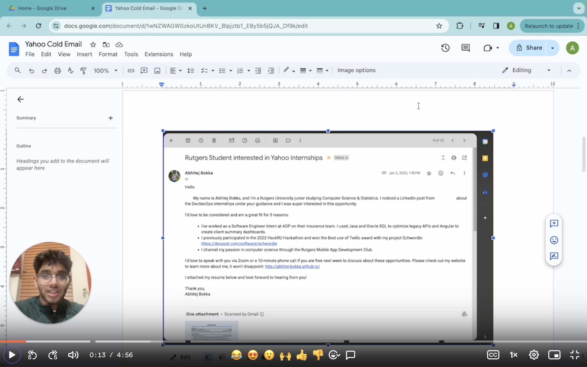
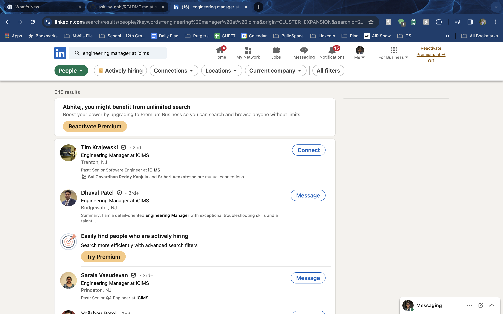
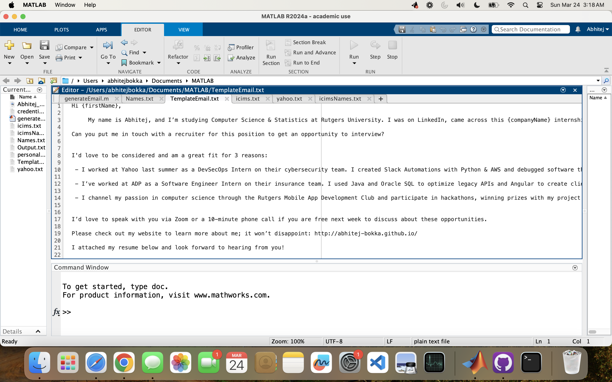

## Inspiration

I remember being a sophomore and junior in college, and I struggled both years to get an internship. Watching my friends land fantastic jobs, I often found myself wishing for 
the same opportunities.

I took this challenge head-on, focusing on elevating my networking skills to what I considered my superpower. My strategy involved sending targeted cold emails to land an internship. Gradually, my method improved with each email I sent, demonstrating the significant power of taking the initiative.

This project stems from the belief that closed mouths aren't fed. Why wait for opportunities when you can create them? 

This is the power of asking, the essence of this project.

Click on the picture - it's a video!

## The End-to-End process

There are two parts to making this work.

First, we collect people we want to email from LinkedIn, and second, we send emails based on their names and companies.

The users first search for engineering managers hiring for their desired role on LinkedIn. They then copy all the contents of the LinkedIn search and add them to a text file. 

This file, full of information, is pre-processed using SpaCy, an open-source library for advanced natural language processing. 

A natural language process (NLP) called Named Entity Recognition is used, which classifies pieces of text into pre-defined categories. It then extracts all the entities (pieces of text) labeled as people and uses additional regex to clean up any extraneous information.

Now, with a list of names, the MatLab code works on splicing together and sending emails with the full name and company name like so: {firstname}.{lastname}@{companyname}.com

It’s configured with MATLAB's preferences to use Gmail's Simple Mail Transfer Protocol (SMTP) server for email sending, including setting up SSL for secure communication. 

It then generates personalized emails for each contact by replacing placeholders in a template with the recipient's information. This is automated through a MATLAB script that reads names from a file, constructs each email, and finally sends it using the configured SMTP settings.

After sending the emails, the script generates an output file containing all personalized emails, providing a record of the outreach effort and enabling us to track our networking activities effectively.

## Challenges we ran into

One of the most significant challenges I faced was implementing the email-sending functionality in Matlab. Gmail has strict authentication requirements, especially for applications attempting to access an account via SMTP. 

Authentication was failing multiple times for various reasons, and this entailed creating app passwords and enabling multi-factor authentication.

## Accomplishments that we're proud of

This was my first time using Matlab outside of math classes, and I’m very proud to have used it unconventionally. As much as I struggled with understanding how SMTP works, reading online documentation and forums helped me understand my problems. This ability to innovate and overcome came through; I’m glad it worked out.

## What we learned

I learned how to use NLP effectively and gained a deeper understanding of SMTP. Being able to code in Python and Matlab gave me the flexibility to take a step back and see how the two automations meshed together and where each language’s capabilities shined.

## What's next for The Power of Asking

Eventually, I can scale this service to automate emails without going to LinkedIn, and it can run as a background service, given simply the job link. It will be game-changing to the internship grind and ensure students can land their dream internship.

